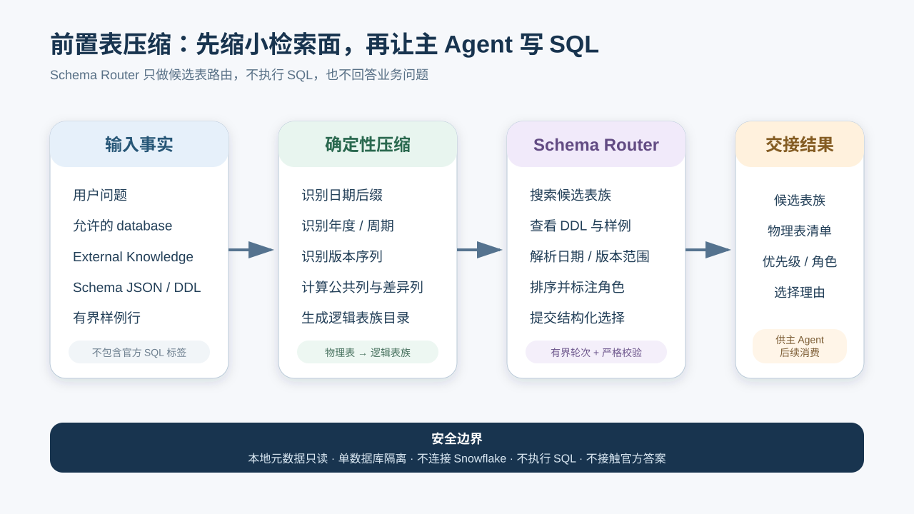
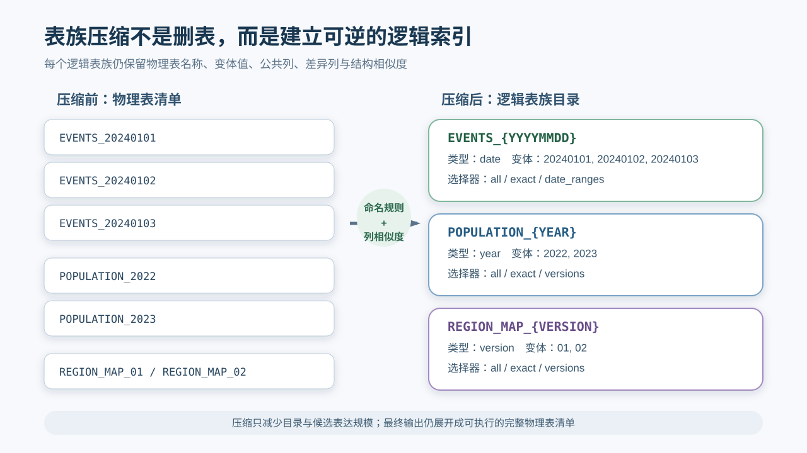
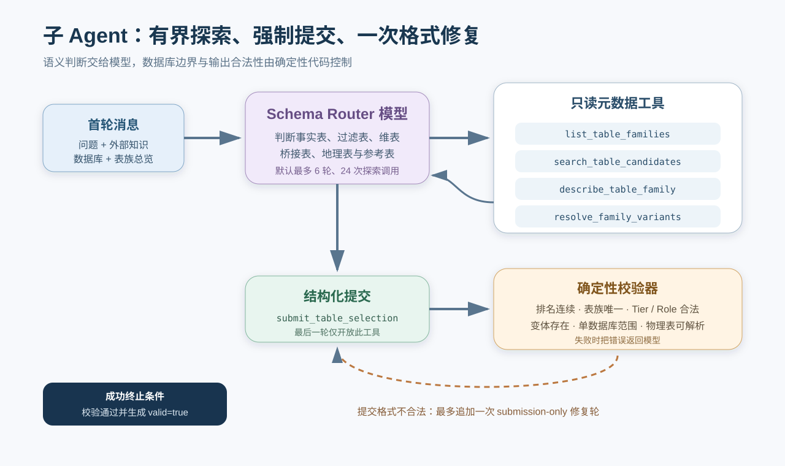
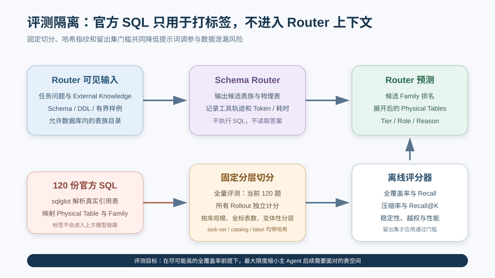

# Spider Agent TC：Schema Router 子 Agent 与前置表压缩设计

> 文档性质：当前实现设计说明、主 Agent 接入契约与评测方案  
> 代码核对日期：2026-07-31  
> 适用范围：`methods/spider-agent-tc/` 中独立 Schema Router、逻辑表族目录、候选表选择、官方 SQL 离线评测，以及未来接入主 Agent 的前置路由阶段

## 技术摘要

Spider 2.0-Snow 的一个数据库可能包含大量物理表，其中还包括按日期、年度、周期或版本拆分的同构表。如果主 Agent 在首轮就看到完整物理表清单，它需要同时承担“理解问题、寻找表、识别分表、选择版本、规划 Join、编写 SQL”六类工作，表名和 Schema 还会持续占用上下文。

当前项目为此实现了一个独立的 `Schema Router` 子 Agent。它在主 Agent 写 SQL 之前运行，只读取本地元数据，完成两层压缩：

1. **确定性表族压缩**：将日期分表、年度表、周期表和版本表归并为可逆的逻辑表族。
2. **任务相关性压缩**：让一个有界工具调用子 Agent 根据问题，从当前数据库的表族中选择、排序并展开真正可能需要的物理表。

Router 的结果不是 SQL，也不是业务答案，而是一份经过严格校验的“候选数据入口清单”。它包含候选表族、物理表展开、重要程度、语义角色和选择理由，可作为主 Agent 后续 Schema 检索与 SQL 求解的白名单或优先目录。



当前状态需要明确区分：

- 逻辑表族构建、Router 子 Agent、独立运行器、结果持久化和官方 SQL 评测已经实现。
- 当前入口是 `run_schema_router.py --config ...`，它在主 Agent 之外独立运行。
- Router 输出尚未接入 `run.py` 的主 Agent 首轮上下文或工具权限，因此本文的“交给主 Agent”部分是已经定义的数据契约和建议接入点，不代表主流程已经启用。

## 一、问题定义

### 1.1 什么是“前置表压缩”

本文中的“表压缩”不是：

- 压缩数据库文件或减少磁盘占用；
- 删除行、抽样业务数据或生成聚合表；
- 用模型改写原始 Schema；
- 提前执行 SQL 或推断最终答案。

它压缩的是主 Agent 面对的**检索空间和上下文表达**：

```text
数据库内全部物理表
  → 可逆的逻辑表族目录
  → 与当前问题相关的候选表族
  → 精确展开后的候选物理表
```

任何被选中的逻辑表族最终都会解析回完整、规范化的物理表名，因此“压缩”不会让后续 SQL 使用模糊表名或省略号。

### 1.2 主要风险

这个阶段存在一个不对称风险：

- 多选一张无关表，会增加少量上下文和搜索成本。
- 漏掉一张事实表、过滤表、桥接表或地理映射表，可能让主 Agent 根本无法求解。

因此设计目标是**召回优先、压缩受约束**。压缩率必须与物理表全覆盖率一起看，不能单独追求“候选越少越好”。

### 1.3 设计目标

| 目标 | 设计响应 |
|---|---|
| 缩小主 Agent 的表搜索面 | 先聚合表族，再按任务选择候选 |
| 不遗漏关键 Join 或映射表 | 候选角色覆盖 fact、filter、dimension、bridge、geography、reference |
| 保留日期与版本精度 | 通过 `exact`、`date_ranges`、`versions` 等选择器可逆展开 |
| 防止越库和幻觉表名 | 所有表族、变体和物理表都由本地 Catalog 校验 |
| 控制模型调用成本 | 有限轮次、有限探索工具调用、有界样例文本 |
| 可独立评测 | 用官方 SQL 解析出的真实引用表作为离线金标 |
| 可复现与可续跑 | 全量任务清单、配置指纹、Prompt 哈希、原子写入和 rollout 级续跑 |

### 1.4 非目标

Schema Router 当前不负责：

- 生成或执行 SQL；
- 验证候选表之间是否能在 Snowflake 中成功 Join；
- 判断最终结果数值是否正确；
- 替代主 Agent 的 Schema 搜索、查询验证和答案提交；
- 使用官方 SQL、评测标签或 Snowflake 数据反向帮助模型选表。

## 二、系统边界与组件

### 2.1 组件划分

| 组件 | 当前实现 | 职责 |
|---|---|---|
| 配置与运行目录 | `agent/schema_router_config.py` | 严格校验单一 YAML，生成运行指纹，处理续跑目录 |
| 表族 Catalog | `agent/schema_router.py` 中的 `SchemaRouterCatalog` | 加载 Schema、DDL 和样例，构建物理表与逻辑表族映射 |
| 元数据工具 | `SchemaRouterTools` | 列表、搜索、描述、解析变体和提交选择 |
| 子 Agent 循环 | `SchemaRouterAgent` | 在有限轮次内调用模型和工具，得到合法选择 |
| 独立运行器 | `run_schema_router.py` | 任务调度、并发、进度、续跑和产物落盘 |
| 离线评测器 | `agent/schema_router_evaluator.py` | 解析全部官方 SQL 标签、生成任务清单、计算指标和门槛 |
| Router Prompt | `prompts/schema_router.txt` | 限定职责、召回优先策略和禁止事项 |

### 2.2 安全与权限边界

Router 的权限小于主 Agent：

```text
允许：任务文本、External Knowledge、本地 Schema JSON、DDL.csv、有界样例行
禁止：Snowflake 查询、SQL 执行、主 Agent 提交工具、官方 SQL、评测标签
```

每个 `SchemaRouterTools` 实例只绑定一个 `database_id` 和一个 `instance_id`。即使模型构造了其他数据库的表族名，校验器也会拒绝，不会把越权引用交给后续流程。

## 三、第一层：确定性的逻辑表族压缩

### 3.1 元数据来源

Catalog 从 `spider2-snow/resource/databases/<database>/<schema>/` 读取：

- 每张物理表对应的 JSON 元数据；
- `DDL.csv` 中的表描述和 DDL；
- JSON 中的字段名、字段类型、字段描述与本地样例行。

这些来源均为本地只读元数据。构建 Catalog 不连接 Snowflake。

### 3.2 表名归并规则

系统先根据物理表名后缀生成暂定表族：

| 物理表模式 | 逻辑表族模式 | `variant_kind` | 变体值示例 |
|---|---|---|---|
| `TABLE_YYYYMMDD` | `TABLE_{YYYYMMDD}` | `date` | `20240131` |
| `TABLE_YEAR_PERIOD` | `TABLE_{YEAR}_{PERIOD}` | `period` | `2023_1YR` |
| `TABLE_YYYY` 或 `TABLEYYYY` | `TABLE_{YEAR}` 或 `TABLE{YEAR}` | `year` | `2023` |
| `TABLE_01` / `TABLE01` 等版本序列 | `TABLE_{VERSION}` / `TABLE{VERSION}` | `version` | `01` |
| 不匹配上述模式 | 原表名 | `singleton` | `current` |

版本候选只有在同一数据库、同一 Schema、同一基名下至少出现两个版本时才会归并；如果存在无后缀的当前表，它也会作为 `current` 变体并入版本族。这样可以降低把普通数字结尾表名错误归并的风险。



### 3.3 结构摘要

每个 `TableFamily` 保存：

| 字段 | 含义 |
|---|---|
| `family_id` | `<database>.<schema>.<logical_name>` 的全限定逻辑标识 |
| `variant_kind` | `date`、`period`、`year`、`version` 或 `singleton` |
| `variants` | 变体值到物理表元数据的完整映射 |
| `common_columns` | 所有成员表都存在的字段 |
| `differing_columns` | 只在部分成员表中出现的字段 |
| `representative_similarity_min` | 首张代表表与其他成员的最低 Jaccard 字段相似度 |
| `representative_similarity_median` | 上述相似度中位数 |

当前相似度用于向 Router 暴露族内结构差异，并不作为拒绝归并的硬门槛。因此，Router 在看到较低相似度或较多差异列时，应主动查看具体变体，而不是假设所有分表完全同构。

### 3.4 为什么先用规则压缩，再让模型选择

纯模型归并难以保证稳定、可逆和大小写一致；纯规则选表又难以理解问题中的业务语义。当前设计把职责拆开：

```text
确定性代码：物理表归并、规范化、边界校验、变体展开
模型子 Agent：问题理解、候选召回、角色判断、排序与解释
```

这使模型不必逐张阅读大量同构分表，同时又不能凭空创造表族或物理表。

## 四、第二层：Schema Router 子 Agent 设计

### 4.1 子 Agent 的单一职责

Schema Router 的唯一任务是：

> 找出并排序解决当前问题所需的全部逻辑表族，并为日期、年度、周期或版本表选择合适的物理变体。

它需要同时考虑：

- 承载指标或事件的事实表；
- 提供筛选条件的表；
- 提供输出字段的维表；
- 连接两个实体的桥接表；
- 地理、行政区、代码或名称映射表；
- 用于校验或消歧的参考表。

### 4.2 子 Agent 可调用的工具

| 工具 | 输入重点 | 输出重点 | 用途 |
|---|---|---|---|
| `list_table_families` | 游标、页大小 | 表族 ID、类型、变体数与预览 | 分页浏览当前数据库全部表族 |
| `search_table_candidates` | 关键词、可选 Schema 范围 | 匹配分数、公共列、差异列 | 按表名、字段和描述寻找候选 |
| `describe_table_family` | 表族 ID、可选变体 | DDL、描述、字段、相似度和有界样例 | 深入判断候选是否满足语义 |
| `resolve_family_variants` | 表族 ID、变体选择器 | 匹配数量与物理表预览 | 提交前检查日期或版本范围 |
| `submit_table_selection` | 排序后的候选数组 | 是否接受、候选数与物理表数 | 唯一的成功终止入口 |

Router 没有通用 Shell、文件读取或 SQL 工具。样例行数量由 `sample_rows` 控制，单项文本由 `max_sample_chars` 截断，并返回截断标记。

### 4.3 有界决策循环

当前 `schema-router.yaml` 设置：

```yaml
schema_router:
  max_rounds: 6
  max_tool_calls: 24
  num_threads: 4
  sample_rows: 1
  max_sample_chars: 4000
```

前 `max_rounds - 1` 轮允许探索工具和提交工具。最后一轮只暴露 `submit_table_selection`，并明确要求模型停止探索、立即提交。如果最终提交仍因格式错误失败，运行器最多追加一次仅用于修复提交参数的格式修复轮。



成功条件不是“模型输出了一段看似合理的 JSON”，而是 `submit_table_selection` 经确定性校验通过，并在结果中形成 `selection.valid = true`。

### 4.4 候选层级

每个候选必须标记一个 `tier`：

| Tier | 定义 | 主 Agent 建议 |
|---|---|---|
| `required` | 缺少它基本无法完成官方风格解法 | 首轮优先注入并允许查询 |
| `supporting` | 很可能用于 Join、维度、映射或验证 | 作为次优先候选保留 |
| `possible` | 有合理关联，但证据仍不足 | 保留为回退，不应与 required 同权 |

候选还必须包含至少一个语义角色：`fact`、`filter`、`dimension`、`bridge`、`geography`、`reference`。

Tier 表示重要程度，Role 表示在解题链路中的作用，两者不能互相替代。

### 4.5 变体选择器

| 模式 | 参数 | 适用场景 |
|---|---|---|
| `all` | 无 | 问题确实需要整个表族，或无法安全缩窄范围 |
| `exact` | 完整物理表名数组 | 已明确知道少量具体物理表 |
| `date_ranges` | 一个或多个 `YYYYMMDD` 起止区间 | 日期分表且问题明确时间范围 |
| `versions` | 变体值数组 | 年度、周期或版本表的精确选择 |

`date_ranges` 只允许用于 `date` 表族；任何不存在的表、变体或空匹配都会被拒绝。

## 五、子 Agent 输入契约

### 5.1 任务输入

每个任务来自 `spider2-snow.jsonl`。Router 实际依赖：

| 字段 | 必需性 | 来源 | 作用 |
|---|---|---|---|
| `instance_id` | 必需 | 任务元数据 | 绑定运行、输出目录和提交身份 |
| `instruction` | 必需 | 题目文本 | 判断指标、实体、过滤、时间与输出字段 |
| `db_id` | 必需 | 任务元数据 | 限定唯一允许访问的数据库 |
| `external_knowledge` | 可选 | 任务元数据指向的本地文档 | 补充业务定义、映射规则或口径 |

需要注意证据来源：`db_id` 和 `external_knowledge` 文件名属于任务元数据，不应描述成题目正文中一定出现的内容。

### 5.2 Catalog 输入

在任务开始前，运行器为官方 SQL 涉及的数据库构建共享只读 Catalog。任务只看到自己 `db_id` 下的 `family_overview`，并只能通过工具查询该数据库的详细元数据。

首次用户消息的逻辑结构是：

```text
Question
  原始 instruction

External Knowledge
  对应文档全文；没有则为 None

Allowed database
  当前 db_id

Complete logical table-family overview
  按 Schema 分组的表族清单、变体类型和变体预览

Action trigger
  使用本地元数据工具探索，并在轮次耗尽前提交选择
```

### 5.3 系统输入与运行约束

除任务信息外，Router 还接收：

- `prompts/schema_router.txt` 的系统提示词；
- 模型名称、采样参数、超时和有限重试策略；
- 最大轮次和最大探索工具调用数；
- 样例行与单项字符预算；
- rollout 编号。

配置、Router 协议版本、Prompt 内容哈希、模型服务地址和密钥身份哈希共同进入运行指纹。Prompt 或协议变化不会错误续跑到旧实验目录。

### 5.4 明确不进入模型上下文的数据

以下信息只用于运行器或离线评分器，不进入 Router 消息：

- 官方 SQL 文本；
- 从官方 SQL 解析出的物理表和表族标签；
- 全量题目的金标统计；
- 其他任务的 Router 预测；
- Snowflake 查询结果。

## 六、子 Agent 输出契约

### 6.1 最终选择结构

一个合法提交的简化示例如下：

```json
{
  "instance_id": "sf_bq010",
  "database_id": "GA360",
  "candidates": [
    {
      "rank": 1,
      "family_id": "GA360.GOOGLE_ANALYTICS_SAMPLE.GA_SESSIONS_{YYYYMMDD}",
      "tier": "required",
      "roles": ["fact", "filter"],
      "reason": "问题需要指定日期的会话事实与过滤字段。",
      "variant_selector": {
        "mode": "exact",
        "tables": [
          "GA360.GOOGLE_ANALYTICS_SAMPLE.GA_SESSIONS_20170701"
        ]
      },
      "resolved_physical_tables": [
        "GA360.GOOGLE_ANALYTICS_SAMPLE.GA_SESSIONS_20170701"
      ]
    }
  ],
  "resolved_physical_tables": [
    "GA360.GOOGLE_ANALYTICS_SAMPLE.GA_SESSIONS_20170701"
  ],
  "valid": true
}
```

其中 `resolved_physical_tables` 由校验器根据选择器生成，不依赖模型自行保证展开完整。

### 6.2 校验规则

提交必须满足：

1. `instance_id` 与当前任务绑定值一致。
2. `candidates` 非空，数量不超过当前数据库表族总数。
3. `rank` 从 1 开始连续递增。
4. `family_id` 在当前数据库存在且不重复。
5. `tier` 和 `roles` 使用允许枚举。
6. `reason` 是非空文本。
7. `variant_selector` 与表族类型匹配且至少解析出一张物理表。
8. `exact` 中的每张表确实属于对应表族。
9. 最终物理表按首次出现顺序去重。

### 6.3 Rollout 产物

每个 rollout 写入：

```text
routing/<instance_id>/rollout-<n>.json
```

成功记录包含：

| 部分 | 内容 |
|---|---|
| `instance_id` / `rollout_idx` | 任务与独立运行编号 |
| `completed` | 是否形成合法选择 |
| `selection` | 规范化候选、物理表展开和 `valid` 标记 |
| `trace` | 每轮可用工具、模型文本、工具名和工具结果 |
| `performance` | 模型调用、重试、工具调用、错误、Token 和耗时 |

失败记录保留 `error`、`trace` 和已有性能数据，不能伪装成已完成。续跑只跳过 `completed = true` 且 `selection.valid = true` 的 rollout；无效或不完整记录会从该 rollout 开始重新运行。

### 6.4 给主 Agent 的建议交接结构

正式接入主流程时，不建议把完整 Router `trace` 塞进主 Agent 上下文。建议只传递：

```text
required_candidates
supporting_candidates
possible_candidates
resolved_physical_tables
router_uncertainties
router_artifact_path
```

其中 `router_uncertainties` 可由 `possible` 候选、族内差异列、低结构相似度和变体选择理由投影得到；`router_artifact_path` 用于需要时回查完整轨迹。

## 七、完整工作流水线

### 阶段 0：加载并冻结运行配置

1. 入口只接受 `--config`。
2. 严格拒绝未知字段和错误类型。
3. 解析任务、数据库元数据、外部文档、官方 SQL 目录和 Prompt 路径。
4. 计算配置与 Prompt 指纹。
5. 在 `results/<experiment>/<timestamp>/` 建立或恢复匹配的未完成运行。
6. 写出脱敏的 `run-manifest.json`。

这一步需要模型密钥，但不需要 Snowflake 凭据。

### 阶段 1：建立全量评测标签与任务清单

此阶段只属于独立评测入口：

1. 枚举官方 SQL 目录中的全部 `.sql` 文件；当前为 120 份，数量不硬编码。
2. 用 Snowflake 方言的 `sqlglot` 解析每份 SQL。
3. 排除 CTE 名称，规范化真实物理表引用。
4. 将物理表映射到逻辑表族。
5. 生成标签哈希和 Catalog 哈希。
6. 按 `instance_id` 稳定排序全部任务并生成 `schema-router-task-set.json`。

标签在运行器内供评分使用，不会进入 Router 的消息或工具结果。

### 阶段 2：构建全局只读表族 Catalog

1. 扫描评测任务涉及的数据库元数据目录。
2. 加载每张表的字段、类型、描述、样例和 DDL。
3. 按日期、周期、年度、版本和单表规则建立表族。
4. 计算公共列、差异列和代表结构相似度。
5. 建立大小写不敏感的规范物理表索引和双向映射。

Catalog 在同一运行内由多个任务只读共享；每个工具实例仍按 `db_id` 隔离可见范围。

### 阶段 3：任务与 Rollout 调度

1. 按稳定顺序选择全部官方 SQL 任务 ID。
2. 根据 `evaluation.rollouts` 展开每题 rollout 数。
3. 检查已有合法 rollout，分成“续跑跳过”和“待运行”。
4. 使用 `num_threads` 并发执行待运行项。
5. 终端仅显示聚合进度，详细错误进入 `run.log`。

### 阶段 4：装配子 Agent 首轮输入

对每个任务：

1. 读取可选 External Knowledge。
2. 创建绑定当前任务和数据库的 `SchemaRouterTools`。
3. 生成当前数据库的完整表族概览。
4. 将问题、知识、数据库边界、概览和动作要求装配为用户消息。
5. 与系统 Prompt 一起进入模型。

### 阶段 5：有界元数据探索

模型按需：

1. 浏览表族分页；
2. 用业务词、字段词或实体词搜索候选；
3. 查看候选的 DDL、字段、变体和样例；
4. 验证日期或版本选择器；
5. 补齐桥接、地理、参考与输出字段来源；
6. 按重要程度排序并提交。

超过探索工具预算后，非提交调用只返回预算耗尽错误；不会无限扩展模型搜索。

### 阶段 6：确定性提交校验与持久化

1. 规范化候选顺序、角色与原因。
2. 校验当前数据库内的表族和物理变体。
3. 展开并去重完整物理表清单。
4. 成功则立即结束 rollout。
5. 失败则返回明确错误；轮次结束后最多追加一次格式修复。
6. 原子写入 rollout JSON，避免中断留下半写文件。

### 阶段 7：离线评分与报告

全部计划 rollout 完成或失败后：

1. 将 Router 预测与当前任务官方 SQL 标签比对。
2. 计算覆盖、召回、压缩、排名、稳定性、越权和性能指标。
3. 写出 `schema-router-summary.json`。
4. 写出可读的 `schema-router-report.md`。
5. 全量评分报告统一应用验收门槛。

### 阶段 8：未来接入主 Agent

建议在主 Agent 的 `receive_problem` / 首轮 Schema 上下文装配之前增加 Router 节点：

```text
任务选择
  → Schema Router
  → Router 结果校验
  → 候选表上下文投影
  → 主 Agent Schema 搜索与 SQL 推理
  → execute_sql
  → terminate
```

接入时建议采用“软白名单 + 显式回退”：

- `required` 和 `supporting` 默认进入主 Agent 首轮目录。
- `possible` 只保留轻量摘要，需要时再展开。
- 主 Agent 若发现候选不足，可显式请求回退到完整 Schema 搜索，并记录 Router miss 信号。
- 不应在尚未达到足够全覆盖率前，把未选表做成不可突破的硬权限黑名单。

这种接入方式能先获得上下文压缩收益，同时避免 Router 一次漏召回直接导致整题不可恢复。

## 八、评测设计



### 8.1 金标构建

当前评测使用仓库公开的 120 份官方 SQL：

1. 使用 `sqlglot` 按 Snowflake 方言解析。
2. 提取所有真实表引用并排除 CTE。
3. 对带库名、带 Schema 和无限定表名分别做规范化。
4. 拒绝越过任务 `db_id`、Catalog 中不存在或无法唯一解析的标签。
5. 生成每题物理表集合和对应表族集合。

这个金标衡量的是“能否覆盖官方 SQL 实际使用的表”，不等价于证明这些表是唯一可行解法，也不衡量最终 SQL 语义正确性。

### 8.2 全量任务集合

每次评测运行当前官方 SQL 目录中的全部可解析题目，当前为 120 题，不设置开发集、留出集或抽样模式。题目 ID 稳定排序后写入 `schema-router-task-set.json`，同时记录任务数、标签哈希和 Catalog 哈希。官方 SQL 或 Catalog 变化会改变运行指纹，不能续跑进旧实验目录。

### 8.3 核心召回指标

设某个 rollout 的预测物理表集合为 \(P\)，官方 SQL 物理表集合为 \(G\)：

```text
物理表 Recall = |P ∩ G| / |G|

物理表题级全覆盖 = 1，当且仅当 G ⊆ P；否则为 0
```

聚合指标包括：

| 指标 | 含义 | 优先级 |
|---|---|---|
| `physical_task_full_coverage` | 每题是否覆盖全部官方物理表的平均值 | 最高；最接近“Router 没卡死下游” |
| `physical_micro_recall` | 所有题的命中物理表总数 / 金标物理表总数 | 高；按表引用加权 |
| `physical_macro_recall` | 各 rollout 物理表 Recall 的平均值 | 高；每题同权 |
| `family_task_full_coverage` | 是否覆盖全部官方表族 | 辅助；观察逻辑层是否找对 |
| `family_micro_recall` / `macro_recall` | 表族粒度总体与题均召回 | 辅助 |

物理表指标比表族指标更严格：选对表族但漏掉所需日期分表，表族召回可能为 100%，物理表召回仍会下降。

### 8.4 压缩指标

对当前数据库：

```text
物理表压缩率 = 1 - 选中物理表数 / 数据库可用物理表数

表族压缩率 = 1 - 选中表族数 / 数据库可用表族数
```

同时记录候选 JSON 的渲染字符数，近似衡量把 Router 结果注入主 Agent 时的上下文体积。

压缩率只能在召回达标后比较。一个只返回一张表但经常漏表的 Router，压缩率很高，却不具备上线价值。

### 8.5 排名与层级诊断

评测计算 `K = 1, 5, 10, 20` 时的：

- Family Recall@K；
- Physical Recall@K。

同时分别计算 `required`、`supporting`、`possible` 候选所覆盖的物理表 Recall。这能回答：

- 关键表是否出现在候选前部；
- Router 是否把必要表错误降级到 `possible`；
- 主 Agent 若只注入 Top-K 或 required 候选，会损失多少召回。

### 8.6 稳定性、越权与性能

多 rollout 实验还需要关注：

- 所有 rollout 都达到物理表全覆盖的任务数；
- 最差单次物理表 Recall；
- 非法表族、非本族变体和未知变体等越权引用次数；
- 完成 / 失败 rollout 数；
- 模型调用、模型重试、探索工具调用、工具错误；
- 输入、输出和总 Token；
- 强制提交与格式修复次数；
- 总耗时和候选渲染字符数。

当前检入的 `schema-router.yaml` 将每题设为 1 个 rollout，因此可以验证覆盖和压缩，但不能充分体现随机稳定性。进行稳定性研究时，应使用新的实验名提高 `evaluation.rollouts`，避免混入旧指纹运行。

### 8.7 全量评测通过门槛

当前配置的冻结门槛为：

| 指标 | 门槛 |
|---|---:|
| 物理表题级全覆盖率 | ≥ 0.97 |
| 物理表 Micro Recall | ≥ 0.99 |
| 非法 / 越权引用 | = 0 |

门槛应用于全量任务的全部独立 rollout。报告始终完整生成；任一门槛未通过时命令返回状态码 2。

### 8.8 推荐的端到端增益评测

独立 Router 指标达标后，还需要做主 Agent A/B，才能证明前置压缩真正改善整体系统：

| 组别 | 主 Agent 输入 |
|---|---|
| Baseline | 当前完整 Schema 工作流，不使用 Router |
| Router-soft | required + supporting 优先注入，允许回退完整 Schema |
| Router-top-k | 固定 Top-K 注入，允许回退并记录触发 |

建议比较：

- 官方 benchmark correctness 或正式评测得分；
- 提交答案率与 `terminated=true` 比例；
- Router miss 导致的失败数；
- 首次有效 SQL 前的模型轮数；
- Schema 工具调用次数与输出字符数；
- 主 Agent 输入 / 输出 Token；
- 任务总耗时、模型耗时和数据库连接 / 查询耗时；
- 回退完整 Schema 的比例。

必须区分：Router 离线全覆盖、主 Agent 成功提交、`terminated=true` 和官方答案正确性是四个不同层级，不能互相替代。

## 九、运行产物与追溯

一次独立评测运行形成：

```text
results/<experiment>/<timestamp>/
├── run-manifest.json
├── run.log
├── schema-router-labels.jsonl
├── schema-router-task-set.json
├── schema-router-summary.json
├── schema-router-report.md
└── routing/
    └── <instance_id>/
        ├── rollout-0.json
        └── rollout-<n>.json
```

| 产物 | 作用 | 是否可进入 Router 上下文 |
|---|---|---|
| `run-manifest.json` | 配置指纹、协议版本、Prompt 哈希和脱敏配置 | 否 |
| `schema-router-labels.jsonl` | 全部官方 SQL 标签 | 严禁 |
| `schema-router-task-set.json` | 全量任务 ID 和数据哈希 | 否 |
| `routing/.../rollout-*.json` | Router 选择、轨迹和性能 | 当前任务完成后产生 |
| `schema-router-summary.json` | 机器可读聚合评分 | 否 |
| `schema-router-report.md` | 人类可读评测报告 | 否 |
| `run.log` | 详细运行和失败诊断 | 否 |

原子写入保证运行被中断时不会把半个 JSON 当成合法结果。配置指纹和 Prompt 哈希保证行为变化不会复用旧结果。

## 十、失败模式与降级策略

| 失败模式 | 当前检测 | 建议处理 |
|---|---|---|
| 元数据 JSON 或 DDL 无效 | Catalog 构建失败并停止 | 修复本地资源；不要让模型猜测 |
| External Knowledge 文件缺失 | 当前任务失败 | 报告具体任务和路径 |
| 模型超时、连接错误、408/409/429/5xx | 有限指数退避重试 | 超出次数后记录失败，不无限重试 |
| 模型只输出自然语言 | 普通轮提醒继续；最终轮视为无有效提交 | 进入一次格式修复，仍失败则 rollout 失败 |
| 工具调用超预算 | 返回预算耗尽错误 | 要求立即提交当前最佳选择 |
| 幻觉表族或越库引用 | 确定性校验拒绝并计数 | 不进入主 Agent 候选 |
| 日期范围无匹配 | 校验拒绝 | 让模型修正范围或使用精确变体 |
| Router 漏召回 | 独立评测发现；主流程尚未接入 | 上线初期使用软白名单并允许主 Agent 回退 |
| 多 rollout 结果不稳定 | 稳定性指标 | 优先修 Prompt / 工具证据，再考虑融合投票 |

## 十一、验证方式

### 11.1 离线代码验证

Router 相关测试覆盖：

- 日期、年度、版本和 singleton 表族构建；
- 大小写规范化与变体选择器；
- 无效表族、变体、排名、Tier 和 Role 拒绝；
- 最终轮强制提交与一次格式修复；
- 可重试和不可重试模型错误；
- 官方 SQL 标签提取、全量任务清单和多 rollout 聚合；
- 配置未知字段、Prompt / 协议指纹；
- 续跑只调度不完整 rollout。

在 `methods/spider-agent-tc` 下执行：

```powershell
python -m pytest tests/test_schema_router.py tests/test_schema_router_config.py tests/test_schema_router_runtime.py -q
python -m compileall agent run_schema_router.py
git diff --check
```

这些检查不连接 Snowflake，也不证明 Router 模型的实际召回率。

### 11.2 全量 Live 评测

Live 评测会对全部官方 SQL 发起模型调用，运行前需要明确授权。所有 rollout 独立评分，失败按零召回计入，不做候选并集、投票或最佳结果筛选。

### 11.3 主 Agent 接入验收

接入主流程前至少满足：

- 全量评测三项门槛全部通过；
- 无官方 SQL 或标签泄漏到 Router 轨迹；
- Router 失败时主 Agent 能明确降级而不是静默空候选；
- 主 Agent 仍能通过现有结构化工具读取完整 SQL 和提交答案；
- A/B 中官方正确性不下降，且上下文或工具成本有可测改善；
- Router 与主 Agent 的耗时分别记录，能够判断压缩收益是否抵消前置调用成本。

## 十二、当前配置画像

以当前 `configs/schema-router.yaml` 为准：

```yaml
schema_router:
  model:
    name: deepseek-v4-flash
    temperature: 0
    top_p: 1
    max_tokens: 12000
    request_timeout_seconds: 180
    retry:
      max_attempts: 3
      initial_delay_seconds: 1
      backoff_multiplier: 2
      max_delay_seconds: 10
  max_rounds: 6
  max_tool_calls: 24
  num_threads: 4
  sample_rows: 1
  max_sample_chars: 4000

evaluation:
  rollouts: 1
  thresholds:
    physical_task_full_coverage: 0.97
    physical_micro_recall: 0.99
    invalid_references: 0
```

这里有四个重要解释：

1. `sample_rows: 1` 只限制 Router 查看本地元数据样例的数量，不代表数据库表只有一行。
2. `max_sample_chars: 4000` 是单项 DDL / 样例预览边界，截断会被显式标记。
3. `num_threads: 4` 是任务 rollout 并发度，不是单个 Router 内部的并行工具数。
4. 全量模式始终应用验收门槛；当前单 rollout 配置也不足以完整判断稳定性。

## 十三、结论

当前 Schema Router 将前置表压缩拆成了两类可审计工作：

```text
确定性表族 Catalog
  负责物理表归并、结构摘要、规范命名、数据库隔离和可逆展开

有界 Schema Router 子 Agent
  负责理解任务、查找候选、补齐 Join 角色、排序并解释选择

确定性提交校验器
  负责拒绝越权和幻觉引用，生成完整物理表清单

官方 SQL 离线评测器
  负责验证全覆盖、召回、压缩、稳定性和性能
```

它的核心价值不是替主 Agent 提前解题，而是把主 Agent 原本反复进行的“浏览海量表名、识别分表、猜测版本、寻找桥接表”变成一个独立、可复现、可评分的前置阶段。

在正式接入前，最关键的判断顺序应保持为：

1. 先验证物理表题级全覆盖和 Micro Recall。
2. 再比较在召回达标条件下的压缩率与候选上下文大小。
3. 然后用多 rollout 检查稳定性与最差情况。
4. 最后通过主 Agent A/B 验证官方正确性、Token、轮数和总耗时是否真正改善。

只有这四层证据同时成立，“前置表压缩”才从一个独立选表实验变成可以安全进入 Spider Agent TC 主流水线的生产组件。
